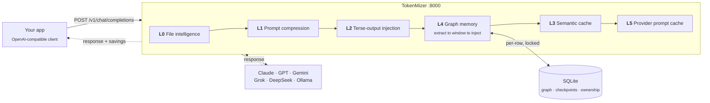

<div align="center">
  

  <h1>TokenMizer</h1>

  <p><strong>Your AI forgets why. TokenMizer remembers.</strong></p>

  <p>
    An OpenAI-compatible proxy that builds a <b>knowledge graph</b> of your
    session — decisions, files, errors, goals — and replays it when the<br/>
    context window runs out. Not a summary: a queryable graph that knows
    <i>"we switched from MongoDB to PostgreSQL, and here is why."</i>
  </p>

  <p>
    <sub>One line to adopt &middot; works with Claude, GPT, Gemini, Grok, DeepSeek, Mistral, Cohere, Ollama &middot; MIT</sub>
  </p>

  <p>
    <a href="https://pypi.org/project/tokenmizer"></a>
    <a href="https://pypi.org/project/tokenmizer"></a>
    <a href="https://github.com/Shweta-Mishra-ai/tokenmizer/actions"></a>
    <a href="https://registry.modelcontextprotocol.io/v0/servers?search=tokenmizer"></a>
    <a href="https://github.com/Shweta-Mishra-ai/tokenmizer/blob/main/LICENSE"></a>
    <a href="https://github.com/Shweta-Mishra-ai/tokenmizer/stargazers"></a>
    <a href="https://glama.ai/mcp/servers/Shweta-Mishra-ai/tokenmizer"></a>
    <a href="https://github.com/sponsors/Shweta-Mishra-ai"></a>
  </p>

  <p>
    <a href="#quick-start"><b>Quick start</b></a> &middot;
    <a href="#see-it"><b>See it</b></a> &middot;
    <a href="#use-it-from-your-tools"><b>Claude Code &amp; MCP</b></a> &middot;
    <a href="#measured"><b>Benchmarks</b></a> &middot;
    <a href="https://github.com/Shweta-Mishra-ai/tokenmizer/blob/main/docs/architecture.md"><b>Architecture</b></a> &middot;
    <a href="https://github.com/Shweta-Mishra-ai/tokenmizer/blob/main/docs/roadmap.md"><b>Roadmap</b></a>
  </p>

  
  <br/>
  <sub>Real run: 25-node graph, checkpoint <code>ckpt_21a0959c3ddf</code>, 233-token resume. Regenerate with <code>python scripts/gen_demo_gif.py</code>.</sub>
</div>

---

## The problem

Every AI session has a context limit. When you hit it, the model forgets
every decision and every rationale built over hours of work, and you
spend the first ten minutes of the next session re-explaining the
project.

Summarising the history does not fix this. A summary tells you *what*
was decided; it loses *why*, and it loses what was rejected — so the
model happily re-proposes the thing you moved off three sessions ago.

## Quick start

```bash
pip install "tokenmizer[anthropic,cache]"
export TOKENMIZER_ANTHROPIC_API_KEY=sk-ant-...
tokenmizer serve
```

Then change one line in your client:

```python
from openai import OpenAI

client = OpenAI(
    api_key="your-key",
    base_url="http://localhost:8000/v1",   # only this changes
)

resp = client.chat.completions.create(
    model="claude-sonnet-4-6",
    messages=[{"role": "user", "content": "Continue where we left off"}],
    extra_body={"session_id": "my-project"},   # optional, enables memory
)
```

Everything else is unchanged: same request shape, same response shape,
plus a `tokenmizer` block reporting what was saved. Open
<http://localhost:8000> and the session is already there.

<details>
<summary><b>Windows, Ollama, Docker, and the full step-by-step</b></summary>

**Windows (PowerShell)**

```powershell
$env:TOKENMIZER_ANTHROPIC_API_KEY = "sk-ant-..."   # this session
setx TOKENMIZER_ANTHROPIC_API_KEY "sk-ant-..."     # persistent
```

**No API key?** Ollama runs locally and free:

```bash
ollama pull llama3
pip install tokenmizer
# then set `provider: ollama` in tokenmizer.yaml
```

**Docker**

```bash
docker compose up -d
```

Full installation notes, every provider's environment variable, and the
configuration reference are in
[**docs/configuration.md**](https://github.com/Shweta-Mishra-ai/tokenmizer/blob/main/docs/configuration.md) and
[**docs/deployment.md**](https://github.com/Shweta-Mishra-ai/tokenmizer/blob/main/docs/deployment.md).
</details>

## See it

Nothing here is a mockup. Every screenshot and the demo below are the
shipped UI rendering a session from the labelled corpus in
`benchmarks/eval/corpus`.

### The session graph is a page you drive, not a picture

<div align="center">
  
  <br/>
  <sub>Radial &rarr; select a node &rarr; force &rarr; filter a type &rarr; timeline &rarr; light. Regenerate with <code>python scripts/gen_graph_demo.py</code>.</sub>
</div>

Select a node and you get its type, status, community, importance,
confidence, when it was first seen and every relation it carries — the
provenance behind a fact, not just the fact. Filter a type or a community
and the counts move with it. Three layouts, a light theme and a PNG
export are one click each.

It is **one self-contained HTML file with no external requests**, so it
opens offline, works from a `file://` URL, and can be sent to someone who
has never installed TokenMizer.

### The dashboard tells you what it actually knows

<div align="center">
  
</div>

Your sessions, the live resume block each one would inject right now, and
its graph — not an example of one. The health pill reads `/health`, which
reports `degraded` with the counters behind it when a write has failed,
rather than saying `ok` whatever happened.

### The session graph, grouped the way you would group it

<div align="center">
  
</div>

Each node type gets its own arc of the circle, named on the ring, and
relations are drawn as chords bowed through the middle — so the shape of
the session is readable before you read a single label, and which type a
node is comes from *where it sits*, not from telling two hues apart. The
palette is checked with a validator, not by eye: every adjacent pair
clears the colour-blind separation floor, and the four types that carry
no meaning of their own share one neutral grey.

The panel beside it counts what the session knows and what is missing —
open issues, decisions changed, history gaps, unconnected nodes — then
lists the detected communities, the hotspots everything hangs off, and
which kinds of node point at which. Filter by type or community, search,
click a node for the supersession chain behind it.

### The same session as a story

<div align="center">
  
</div>

Timeline mode puts each node type in its own lane, ordered by when the
fact entered the session, with supersessions drawn as arcs. When a whole
transcript was checkpointed in one call every node shares a timestamp, so
the axis says so and falls back to the order the session stated things
rather than inventing dates.

## How it works

TokenMizer is a local proxy between your app and any LLM. Every request
passes through a pipeline that builds a live knowledge graph, compresses
inputs, caches responses, and checkpoints before the context runs out.



The graph is not a summary. It is typed nodes and edges — decisions,
tasks, files, errors, goals — with a lifecycle, so a decision that gets
replaced is marked superseded rather than deleted, and the transition
records what triggered it. The resume block is a filtered projection of
it: active decisions, open work, unresolved errors, in a few hundred
tokens.

Edges carry the relations a session actually has. A task that fixed a bug
`FIXES` the error node and closes it. An open error `BLOCKS` the task
about it. A decision `DEPENDS_ON` the package it named. That is what the
communities above are detected from, and what `/why` walks.

To [**Architecture**](https://github.com/Shweta-Mishra-ai/tokenmizer/blob/main/docs/architecture.md) — the request sequence, the
data model, and the decision lifecycle.

## What a resume looks like

```
Goal: FastAPI authentication service with JWT and PostgreSQL
Working on: refresh token rotation in api/auth.py | rate limiting using slowapi
Done: Implemented POST /api/auth/login | Fixed the 422 in LoginRequest | User model in api/models.py
Decided: Use JWT and PostgreSQL | bcrypt for password hashing | Redis for refresh token storage
Changes: 'Use moment.js' -> 'Use date-fns' - tree-shakeable, saves 230KB
Files: api/auth.py, api/models.py, config.py, tests/test_auth.py
Continue from: Add rate limiting to auth endpoints
```

A few hundred tokens in place of the whole conversation. The `Changes:`
line is the part a summary loses — and
`GET /api/graph/{session_id}/why?q=date-fns` replays the full chain with
the trigger, the reason and the evidence for each hop.

### Habits, not just projects

A session graph remembers what you decided *about this project*. It does
not remember that you want short answers — that is true of you, not of
the repository, and it has to survive starting a session somewhere else.

```yaml
preferences:
  enabled: true      # off by default; read the note before turning it on
```

With it on, a turn like "I prefer TypeScript, and keep answers brief" is
remembered per principal and injected as a few lines of system prompt.
`/api/preferences` (GET) shows exactly what was remembered and the exact
text it injects; the same path with DELETE and `?key=...` forgets one,
without a key forgets all of them.

**Off by default on purpose.** The failure mode of a preference memory is
not forgetting — it is remembering something that was never a preference
and repeating it in every prompt you send for the rest of the year. The
detector is a set of regexes and it will have false positives, which is
why the endpoint above exists and why you turn this on deliberately.

### Not only coding sessions

Set `domain` and the same five shapes are read in another vocabulary.
Nobody in an incident channel says "Decided:", and nobody in a research
log says "Fixed:" — which is why those sessions used to come back nearly
empty (**macro F1 11%**, decisions and errors at **0%**).

```yaml
domain: ops        # coding (default) · research · ops · product
```

```
Incident: We are seeing an incident on the pricing service, checkout is failing
Mitigating: Still monitoring the replica lag | Follow-up to add a pool-size alert
Done: Restarted the pool workers and rolled back to build 4471 | Traffic is recovered
Decided: Root cause is connection pool exhaustion after the 14:02 deploy
Symptoms: Error rate is 34 percent and p99 latency jumped to 8 seconds
```

**11% to 96%** on the labelled sessions in `benchmarks/eval/corpus_domains`,
with the coding corpus unchanged — a pack's patterns run *after* the
coding ones and can only add. Three hand-written sessions, so read it as
"the mechanism works on sessions of this shape", not as a generalisation
claim; the [benchmarks](https://github.com/Shweta-Mishra-ai/tokenmizer/blob/main/docs/benchmarks.md) say the same.

## Use it from your tools

Four ways in, depending on where you work. All of them talk to the same
graph, so a session checkpointed from Claude Code resumes in the CLI.

### Claude Code — plugin

```
/plugin marketplace add Shweta-Mishra-ai/tokenmizer
/plugin install tokenmizer@Shweta-Mishra-ai/tokenmizer
```

Then, in any session:

```
/tokenmizer:checkpoint my-project      save the session to graph memory
/tokenmizer:resume my-project          load it back (~300 tokens)
/tokenmizer:analyze data/sales.csv     digest a large file
/tokenmizer:stats                      token savings report
```

### Claude Desktop, Cursor, VS Code, Zed — MCP server

<!-- mcp-name: io.github.Shweta-Mishra-ai/tokenmizer -->

```json
{
  "mcpServers": {
    "tokenmizer": {
      "command": "tokenmizer-mcp",
      "env": { "TOKENMIZER_URL": "http://localhost:8000" }
    }
  }
}
```

| Client | Where that goes |
|---|---|
| Claude Desktop (macOS) | `~/Library/Application Support/Claude/claude_desktop_config.json` |
| Claude Desktop (Windows) | `%APPDATA%\Claude\claude_desktop_config.json` |
| Claude Code | `.mcp.json` in the project, or `~/.claude/settings.json` |
| Cursor | Settings, MCP, Add server, same JSON |
| VS Code / Zed | their MCP settings, same `command` and `env` |
| Codex CLI | `~/.codex/config.toml` — TOML, see [docs/api.md](https://github.com/Shweta-Mishra-ai/tokenmizer/blob/main/docs/api.md) |

Restart the client afterwards. **You do not need to start anything else:**
`checkpoint_session`, `resume_session`, `get_graph_stats`, `why_decision`
and `analyze_file` all read and write the graph directly when
`tokenmizer serve` is not running, and say which path answered. Only
savings need the proxy, since savings are measured on requests that pass
through it. If `tokenmizer-mcp` is not on your PATH, use
`"command": "python", "args": ["-m", "tokenmizer.mcp.server"]`.

**Six tools:** `checkpoint_session`, `resume_session`, `get_graph_stats`,
`get_savings_stats`, `analyze_file`, and `why_decision` — ask your agent
*"why did we pick X?"* and it walks the supersession chain with the
reason and evidence for each hop.

### Anything else — the proxy

Any OpenAI-compatible client works by pointing `base_url` at
`http://localhost:8000/v1`, as in the quick start above. That covers
Continue.dev, Aider, LangChain, LlamaIndex, the OpenAI SDKs in every
language, and `curl`.

**Tool calling goes through too.** Send `tools` / `tool_choice` in the
OpenAI shape and get `message.tool_calls` back, streamed or not, with
`role: "tool"` results round-tripping to the model:

```python
resp = client.chat.completions.create(
    model="claude-sonnet-4-6",
    messages=[{"role": "user", "content": "weather in Pune?"}],
    tools=[{"type": "function", "function": {
        "name": "get_weather",
        "parameters": {"type": "object", "properties": {"city": {"type": "string"}}}}}],
    extra_body={"session_id": "my-project"},
)
call = resp.choices[0].message.tool_calls[0]     # finish_reason == "tool_calls"
```

Native for OpenAI, DeepSeek, Mistral, OpenRouter and Grok; translated for
Anthropic, Ollama, Gemini and Cohere. **All nine providers**, streamed or
not — each one's tool calls arrive on the stream as OpenAI-shaped deltas,
whether the provider fragments them (Anthropic, Cohere) or sends them
whole (Ollama, Gemini). Tool traffic is never compressed, and a tool-call
turn is never cached.

To [**API & CLI reference**](https://github.com/Shweta-Mishra-ai/tokenmizer/blob/main/docs/api.md) — every endpoint, every command,
every MCP tool.

### Inside an agent — in-process, no server

For an agent loop that already owns its messages, use the memory directly.
No proxy, no API key, no network; the same SQLite store the proxy uses, so
an agent and the proxy can share a session.

```python
from tokenmizer.agents import Memory

memory = Memory("order-service")          # default: the working directory name
memory.add(messages)                      # {"role", "content"} dicts; idempotent
memory.search("what are we storing orders in", top_k=5)
memory.context(token_budget=400)          # resume block for the system prompt
memory.why("postgres")                    # the decision trail
```

`search` returns plain dicts (`type`, `label`, `summary`, `status`,
`confidence`); `decisions()` and `errors()` list each category. Works with
LangGraph, CrewAI, AutoGen or a hand-written loop the same way: call `add`
with the conversation so far, put `context()` in the system prompt.

## Measured

`python -m benchmarks.eval` scores extraction against a labelled corpus
of 14 sessions, 6 of them real transcripts:

| Category | Precision | Recall | F1 |
|---|---|---|---|
| Files | 98% | 100% | **99%** |
| Decisions | 97% | 100% | **99%** |
| Completed tasks | 98% | 98% | **98%** |
| Pending tasks | 100% | 90% | **95%** |
| Errors | 93% | 96% | **94%** |
| | | **macro F1** | **97%** |

**Precision is reported, not just recall.** An extractor that emits the
whole transcript as one node scores 100% recall, which is why
recall-only extraction numbers should be distrusted — including our own
earlier ones.

Scored separately by origin, because hand-written fixtures are easier
than real transcripts and a single headline hides that: **synthetic 98%,
real 91%.** Treat 91% as the number that describes real sessions. n=14
is a small sample and the same person wrote every label.

**Retrieval is measured separately.** `python -m
benchmarks.graph_retrieval.query_eval` scores what `query()` returns for
questions phrased the way a person asks them, not in the node's own
words: **recall@6 82% over 40 cases**, keyword ranking only. The eval was
13 cases until this branch, where one case flipping moved the headline by
8 points; every case is checked to be answerable from its own transcript,
because an ungrounded question measures extraction and reads as a
retrieval failure forever. `semantic_retrieval: auto` turns on embedding
similarity when the model actually loads — the 92% figure previously
quoted for it predates the enlarged eval and has not been re-measured.

**Independently verified against 7 other methods.** A separate
100-session benchmark ([tokenmizer-research](https://github.com/Shweta-Mishra-ai/tokenmizer-research),
a different corpus and scorer than the numbers above) ties TokenMizer
0.5.4 for first place at **60% macro F1** — level with Mem0-style (60%)
and Graphiti-style (59%), ahead of GraphRAG-style (44%), MemGPT-style
(35%), and every naive baseline (under 20%).

To [**Benchmarks**](https://github.com/Shweta-Mishra-ai/tokenmizer/blob/main/docs/benchmarks.md) — memory quality against a
plain-summary baseline, storage, and how to score your own sessions.

## Why TokenMizer and not X?

**Why not just use Git history?**
Git stores *what changed*, not *why you decided to change it*. You cannot ask Git "what did we decide about auth?" or "why did we switch from MySQL to PostgreSQL?" TokenMizer stores decisions with trigger, reason, and evidence — not diffs.

**Why not RAG (retrieval-augmented generation)?**
RAG retrieves *relevant chunks* — it does not model *decision state*. If you switched from bcrypt to Argon2 mid-session, RAG might retrieve both and confuse the model about which is current. TokenMizer tracks decision supersession explicitly: the old decision is marked `SUPERSEDED`, the new one `ACTIVE`, and the resume context only includes current state.

**Why not a plain summary at the start of each session?**
Summaries lose structure. You cannot query "all superseded decisions" or "what triggered the auth change" from a blob of text. Our benchmark shows graph memory preserves **89%** of labelled information against **79%** for a summary baseline — and unlike a summary, the graph is queryable, editable, and grows incrementally instead of being re-summarized every turn. See [Benchmarks](https://github.com/Shweta-Mishra-ai/tokenmizer/blob/main/docs/benchmarks.md#memory-quality--graph-vs-a-plain-summary).

**Why not Mem0 or Zep?**
Mem0 and Zep store *facts* ("user prefers Python"). TokenMizer stores *decisions with rationale* — the full causal chain: what was decided, what replaced it, why, what evidence triggered the change. If you need "remember my name across sessions," use Mem0. If you need "remember that we switched from PostgreSQL to SQLite because of cost, and here is the evidence," use TokenMizer.

**Why not Graphiti?**
Both build a temporal knowledge graph, and on the independent benchmark above they score within a point of each other. The differences are operational: TokenMizer runs on SQLite with no database to deploy, ships the graph as a self-contained HTML page you can open offline or send to someone, and is an OpenAI-compatible proxy — so adopting it is a base URL change rather than an integration. Graphiti is the better fit if you are already running Neo4j and want to query the graph in Cypher.

**Why not just a longer context window?**
Longer context means higher cost, slower inference, and attention dilution on long histories. TokenMizer compresses a session into a resume block averaging **161 tokens** (measured, n=3 — see [Benchmarks](https://github.com/Shweta-Mishra-ai/tokenmizer/blob/main/docs/benchmarks.md)) by extracting what actually matters, not by summarizing.

## What is not implemented

Listed here rather than left to be discovered:

| Setting | Status |
|---|---|
| `routing.*` | **Deprecated, removed next release.** Never implemented. Use `model_map` (below) to send one model name to another — that is what it was reached for. A config carrying a `routing:` block still loads and logs a deprecation warning. |
| `state_backend: redis` | Accepted, never implemented; behaves as `memory` and warns at startup. Use `state_backend: sqlite`, which shares the rate limiter across workers on one host. |
| `functions` / `function_call` (the deprecated OpenAI shape) | Accepted and ignored, with a server-side warning. Use `tools` / `tool_choice`, which are forwarded. |

The prioritised plan for these and everything else is in
[**docs/roadmap.md**](https://github.com/Shweta-Mishra-ai/tokenmizer/blob/main/docs/roadmap.md), which pairs every planned item
with the measurement that motivates it.

## Documentation

| | |
|---|---|
| [**Architecture**](https://github.com/Shweta-Mishra-ai/tokenmizer/blob/main/docs/architecture.md) | Request pipeline, graph data model, decision lifecycle, file intelligence |
| [**Configuration**](https://github.com/Shweta-Mishra-ai/tokenmizer/blob/main/docs/configuration.md) | Every setting, environment variables, precedence, providers |
| [**API & CLI**](https://github.com/Shweta-Mishra-ai/tokenmizer/blob/main/docs/api.md) | Endpoints, commands, MCP tools, tool calling, Claude Code integration |
| [**Deployment**](https://github.com/Shweta-Mishra-ai/tokenmizer/blob/main/docs/deployment.md) | Docker, multiple workers, durability, session isolation, security |
| [**Benchmarks**](https://github.com/Shweta-Mishra-ai/tokenmizer/blob/main/docs/benchmarks.md) | Extraction quality, memory quality, storage, running your own |
| [**Roadmap**](https://github.com/Shweta-Mishra-ai/tokenmizer/blob/main/docs/roadmap.md) | Measured state of every layer, and the prioritised plan |
| [**Comparisons**](https://github.com/Shweta-Mishra-ai/tokenmizer/blob/main/docs/comparisons.md) | Running alongside other token tools |
| [**Contributing**](https://github.com/Shweta-Mishra-ai/tokenmizer/blob/main/CONTRIBUTING.md) | Setup, layer rules, and how to improve extraction |
| [**Testing**](https://github.com/Shweta-Mishra-ai/tokenmizer/blob/main/TESTING.md) | How to run the suite, the coverage floor, and known limits |
| [**Changelog**](https://github.com/Shweta-Mishra-ai/tokenmizer/blob/main/CHANGELOG.md) &middot; [**Security**](https://github.com/Shweta-Mishra-ai/tokenmizer/blob/main/SECURITY.md) | Release history and how to report a vulnerability |

## Contributing

```bash
git clone https://github.com/Shweta-Mishra-ai/tokenmizer
cd tokenmizer
pip install -e ".[dev]"
pytest tests/ -q && ruff check tokenmizer/     # 1448 tests, must stay green
```

**The most valuable contribution is a session where extraction got it
wrong.** The eval corpus is 14 sessions and the same person wrote every
label in it — that is the honest ceiling on what the numbers above can
tell you about *your* workload, and the only way past it is transcripts
nobody here wrote. Label a few of your own in the format documented in
[`benchmarks/eval/corpus.py`](https://github.com/Shweta-Mishra-ai/tokenmizer/blob/main/benchmarks/eval/corpus.py) and open a PR,
or [open an issue](https://github.com/Shweta-Mishra-ai/tokenmizer/issues)
with the turn that was missed. Redact freely — the shape of the prose is
what matters, not its content.

[CONTRIBUTING.md](https://github.com/Shweta-Mishra-ai/tokenmizer/blob/main/CONTRIBUTING.md) covers setup, the layer rules, and how
to run the eval harness.

## Contributors

TokenMizer is better because of the people who found something wrong with
it and said so. Thank you.

<div align="center">
  <a href="https://github.com/Shweta-Mishra-ai/tokenmizer/graphs/contributors">
    
  </a>
  <br/>
  <sub>Updates itself as people contribute &middot; <a href="https://github.com/Shweta-Mishra-ai/tokenmizer/graphs/contributors">full contributor graph</a></sub>
</div>

The avatars above come from GitHub's contributor list, which counts
commits. These lists do not, because some of the most useful things
anyone did here never touched the code.

**Sent a fix**

- [**@0xfroOty**](https://github.com/0xfroOty) — negated-decision handling in the decision tracker ([#22](https://github.com/Shweta-Mishra-ai/tokenmizer/pull/22)), `OutputTrimmer` level alignment ([#25](https://github.com/Shweta-Mishra-ai/tokenmizer/pull/25)), streaming cache-hit analytics ([#31](https://github.com/Shweta-Mishra-ai/tokenmizer/pull/31))
- [**@pollychen-lab**](https://github.com/pollychen-lab) — graph node IDs derived from stored (truncated) labels ([#21](https://github.com/Shweta-Mishra-ai/tokenmizer/pull/21)), semantic-opposite decision detection ([#26](https://github.com/Shweta-Mishra-ai/tokenmizer/pull/26))
- [**@floze-the-genius**](https://github.com/floze-the-genius) — dashboard stats authentication fix ([#35](https://github.com/Shweta-Mishra-ai/tokenmizer/pull/35))
- [**@TechNovaWorldai**](https://github.com/TechNovaWorldai) — the `minimal` terse prompt trimmed back under its own token budget ([#63](https://github.com/Shweta-Mishra-ai/tokenmizer/pull/63))

**Found the bug in the first place** — which this project considers the
harder half, and says so above

- [**@0xfroOty**](https://github.com/0xfroOty) — opposite decisions merged into one node ([#19](https://github.com/Shweta-Mishra-ai/tokenmizer/issues/19)), node IDs colliding after label truncation ([#20](https://github.com/Shweta-Mishra-ai/tokenmizer/issues/20)), `full` trimming behaving like `lite` ([#23](https://github.com/Shweta-Mishra-ai/tokenmizer/issues/23)), streaming always recording `cache_hit=False` ([#30](https://github.com/Shweta-Mishra-ai/tokenmizer/issues/30)), dashboard stats failing under an API key ([#34](https://github.com/Shweta-Mishra-ai/tokenmizer/issues/34))
- [**@TechNovaWorldai**](https://github.com/TechNovaWorldai) — the terse prompt over its own budget ([#62](https://github.com/Shweta-Mishra-ai/tokenmizer/issues/62))

**Looked at it from the outside**

- [**@neoneye**](https://github.com/neoneye) (Simon Strandgaard) — an independent analysis of TokenMizer and a place for it among other agent-memory systems in the [agent memory atlas](https://neoneye.github.io/agent-memory-atlas/compare/) ([#39](https://github.com/Shweta-Mishra-ai/tokenmizer/issues/39))

## Support

If TokenMizer is useful to you, please give it a
[star](https://github.com/Shweta-Mishra-ai/tokenmizer). It takes a
second and it genuinely helps.

[Sponsorship](https://github.com/sponsors/Shweta-Mishra-ai) is open too,
if you would like to support the work. Entirely optional.

## License

MIT &copy; [Shweta Mishra](https://github.com/Shweta-Mishra-ai)
