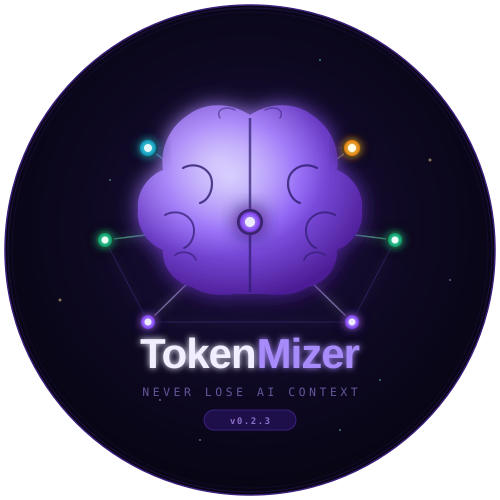
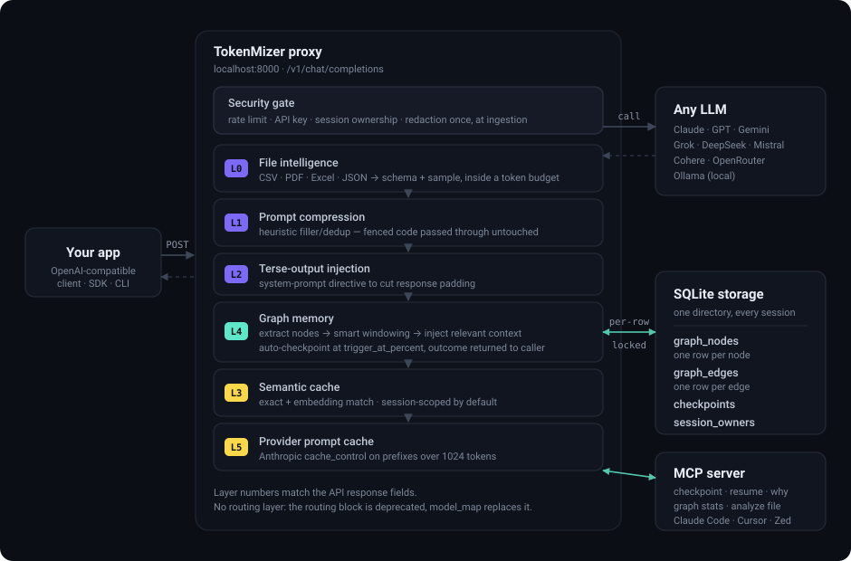

<div align="center">
  

  <h1>TokenMizer</h1>

  <p><strong>Never lose your AI context again.</strong></p>

  <p>
    Graph-backed memory · session checkpointing · intelligent compression<br/>
    Drop-in proxy for Claude, GPT, Gemini, Grok, DeepSeek, Ollama — any LLM.
  </p>

  <p>
    <a href="https://pypi.org/project/tokenmizer"></a>
    <a href="https://pypi.org/project/tokenmizer"></a>
    <a href="LICENSE"></a>
    <a href="https://github.com/Shweta-Mishra-ai/tokenmizer/actions"></a>
    
    
  </p>
</div>

---

## The Problem

Every AI session has a context limit. When you hit it:

- The model forgets every decision, rationale, and context built over hours
- You waste 10–30 minutes re-explaining the project every new session
- Large files (CSV, PDF, Excel) eat your entire token budget instantly

## How TokenMizer Solves It

TokenMizer is a **local proxy** between your app and any LLM. Every request goes through a pipeline that builds a live knowledge graph, compresses inputs, caches responses, and auto-checkpoints before context runs out.

```
Your App  →  TokenMizer (:8000)  →  Claude / GPT / Gemini / any LLM
                    │
          ┌─────────┴──────────────┐
          │   6-Layer Pipeline     │
          │   L0  File Intel       │  CSV/PDF/Excel → schema + sample
          │   L1  Compression      │  15–40% input reduction
          │   L2  Output Trim      │  5–15% output reduction
          │   L3  Semantic Cache   │  100% on repeated queries
          │   L4  Graph Memory     │  session continuity
          │   L5  Prompt Cache     │  90% on repeated system prompts
          └────────────────────────┘
```

---

## Architecture

<div align="center">
  
</div>

### Decision Memory — 4-State Model

| Status | Meaning | In Resume |
|---|---|---|
| 🟢 `ACTIVE` | Current — in effect | ✅ Always |
| 🟡 `SUPERSEDED` | Replaced by newer decision | ⚠️ 7 days |
| 🔴 `INVALIDATED` | Explicitly wrong/cancelled | ⚠️ Always (warning) |
| ⬜ `ARCHIVED` | Old but valid, not relevant | ❌ Never |

History is **never deleted**. "Why did we switch from React to Next.js?" — always answerable.

---

## Quick Start

### 1. Install

```bash
# Recommended
pip install "tokenmizer[anthropic,cache]"

# All providers
pip install "tokenmizer[anthropic,openai,gemini,cohere,cache]"

# No key? Use Ollama (free, local)
brew install ollama && ollama pull llama3
pip install tokenmizer
```

### 2. Set your API key

```bash
export TOKENMIZER_ANTHROPIC_API_KEY=sk-ant-...
# or: TOKENMIZER_OPENAI_API_KEY, TOKENMIZER_GEMINI_API_KEY, etc.
```

### 3. Start

```bash
tokenmizer serve
# → Proxy:     http://localhost:8000/v1/chat/completions
# → Dashboard: http://localhost:8000
# → API docs:  http://localhost:8000/docs
```

### 4. Use — change one line

```python
from openai import OpenAI

client = OpenAI(
    api_key="your-key",
    base_url="http://localhost:8000/v1",  # ← only this changes
)

response = client.chat.completions.create(
    model="claude-sonnet-4-6",
    messages=[{"role": "user", "content": "Let's build an auth service"}],
    extra_body={"session_id": "my-project"},  # enables graph memory
)
```

---

## Claude Code Integration

### Option A — Plugin (recommended)

```bash
# Add TokenMizer as a plugin marketplace
/plugin marketplace add Shweta-Mishra-ai/tokenmizer

# Install
/plugin install tokenmizer@Shweta-Mishra-ai/tokenmizer
```

Then use skills directly:

```
/tokenmizer:checkpoint my-project      → save session to graph memory
/tokenmizer:resume my-project          → load previous session (300 tokens)
/tokenmizer:resume my-project full     → full 600-token context
/tokenmizer:analyze /data/sales.csv    → analyze file (99% token savings)
/tokenmizer:stats                      → token savings report
```

### Option B — MCP server

Add to `~/.claude/settings.json`:

```json
{
  "mcpServers": {
    "tokenmizer": {
      "command": "python",
      "args": ["-m", "tokenmizer.mcp.server"],
      "env": { "TOKENMIZER_URL": "http://localhost:8000" }
    }
  }
}
```

---

## Other Tools

**Cursor / Continue.dev / any OpenAI-compatible tool:**
```
API Base URL:  http://localhost:8000/v1
```

---

## Session Resume

```bash
tokenmizer checkpoint my-project
tokenmizer resume my-project
```

```
Goal: Build FastAPI auth service with JWT + PostgreSQL
Done: Project setup | User model | Login endpoint | Fix 422 | 18 tests passing
In progress: Refresh token rotation
Decided: PostgreSQL (concurrent writes) | bcrypt | Redis for refresh tokens
Changed: ~~React~~ → Next.js (better SEO)
Files: api/auth.py, api/models.py, config.py
Continue: Implement token refresh endpoint
```

**247 tokens** replaces **25,000+ tokens** of conversation history.

---

## File Intelligence

```python
from tokenmizer.filters.file_intelligence import FileIntelligence

fi = FileIntelligence()
result = fi.process(open("sales.csv","rb").read(), "sales.csv",
                    token_budget=500, query="which regions underperforming")
# 412,000 tokens → 447 tokens  (99.9% saved)
```

| File | Savings |
|---|---|
| CSV (50k rows) | 99.9% |
| PDF (200 pages) | 98.8% |
| Excel (10 sheets) | 99.7% |
| JSON (1k items) | 95% |

---

## Works Alongside Caveman & CodeBurn

TokenMizer **complements** — does not replace — these tools:

| Tool | What it does |
|---|---|
| **Caveman** | Output tokens shorter (~65%) |
| **CodeBurn** | Input context trimming |
| **TokenMizer** | Graph memory + resume + file intelligence + cache |

> **Tip:** If using Caveman, set `terse_output: enabled: false` in `tokenmizer.yaml` to avoid conflicting system prompts.

---

## Supported Providers

| Provider | Env var |
|---|---|
| Anthropic (Claude) | `TOKENMIZER_ANTHROPIC_API_KEY` |
| OpenAI | `TOKENMIZER_OPENAI_API_KEY` |
| Google Gemini | `TOKENMIZER_GEMINI_API_KEY` |
| DeepSeek | `TOKENMIZER_DEEPSEEK_API_KEY` |
| Mistral | `TOKENMIZER_MISTRAL_API_KEY` |
| Grok (xAI) | `TOKENMIZER_GROK_API_KEY` |
| Cohere | `TOKENMIZER_COHERE_API_KEY` |
| OpenRouter | `TOKENMIZER_OPENROUTER_API_KEY` |
| Ollama | No key — free, local |

---

## Configuration

```yaml
# tokenmizer.yaml
provider: anthropic
default_model: claude-sonnet-4-6

graph_checkpoint:
  enabled: true
  trigger_at_percent: 0.85
  use_llm_extraction: false     # true = 80%+ recall, needs key (~$0.001/turn)

compression:
  enabled: true

cache:
  enabled: true
  max_size: 10000

state_backend: memory           # memory | redis (production)
```

All settings via env vars: `TOKENMIZER_PROVIDER`, `TOKENMIZER_API_KEY`, etc.

---

## Docker

```bash
# Quick start
docker-compose up tokenmizer

# With Redis (production)
ANTHROPIC_API_KEY=sk-ant-... docker-compose up

# With proxy auth
TOKENMIZER_API_KEY=strong-key docker-compose up
```

---

## API Reference

| Endpoint | Method | Description |
|---|---|---|
| `/v1/chat/completions` | POST | OpenAI-compatible proxy |
| `/api/resume/{id}` | GET | Get resume context |
| `/api/checkpoint` | POST | Manual checkpoint |
| `/api/decision/invalidate` | POST | Mark decision as invalid |
| `/api/graph/{id}` | GET | Session graph stats |
| `/api/stats` | GET | Token savings analytics |
| `/health` | GET | Health check |
| `/docs` | GET | Swagger UI |

---

## Security

- API key auth — `TOKENMIZER_API_KEY`
- Secret redaction before graph storage
- Session-isolated cache (sensitive data never shared)
- Prompt injection detection
- CORS restricted

---

## Benchmarks

```bash
python -m benchmarks.checkpoint_accuracy.runner
pytest tests/ -v
```

**Heuristic (default):** Task recall ~75% · Decision recall ~75% · File recall ~100%

**With `use_llm_extraction: true`:** Task recall ~85–90% · Decision recall ~85–90%

---

## CLI

```bash
tokenmizer serve [--port 8000]
tokenmizer checkpoint <session-id>
tokenmizer resume <session-id> [--level standard|full|critical]
tokenmizer analyze <file> [query]
tokenmizer stats
```

---

## Contributing

See [CONTRIBUTING.md](CONTRIBUTING.md). Graph extraction contributions are the highest priority.

```bash
git clone https://github.com/Shweta-Mishra-ai/tokenmizer
pip install -e ".[dev]"
pytest tests/ -v && ruff check tokenmizer/
```

---

## License

MIT © [Shweta Mishra](https://github.com/Shweta-Mishra-ai)

---

<div align="center">
  <sub>Built for developers who spend too much time re-explaining their projects to AI.</sub>
</div>
