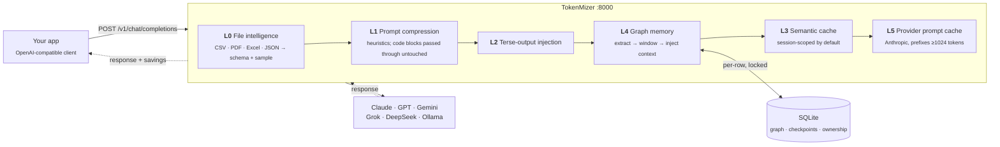
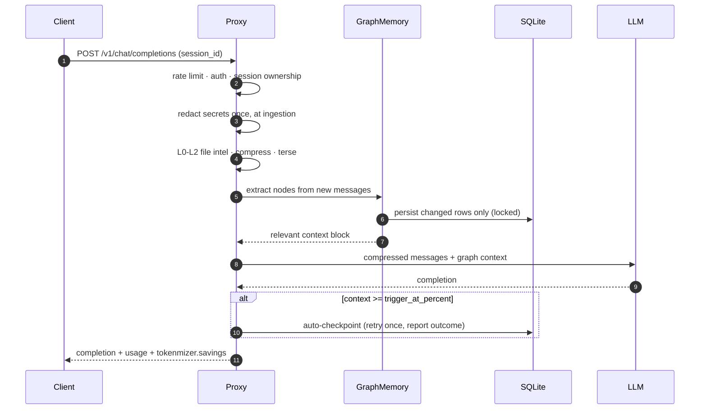
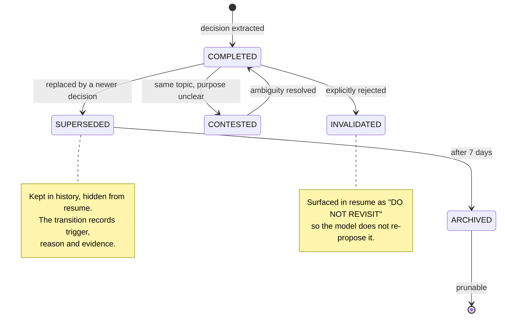
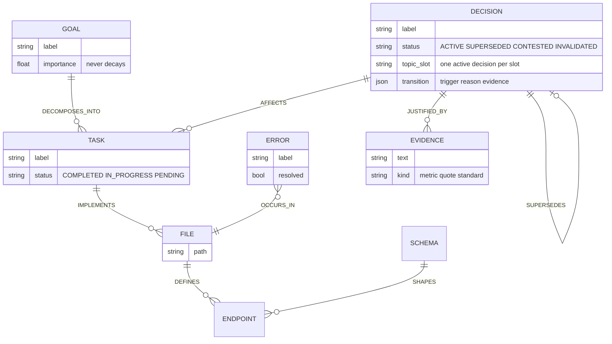
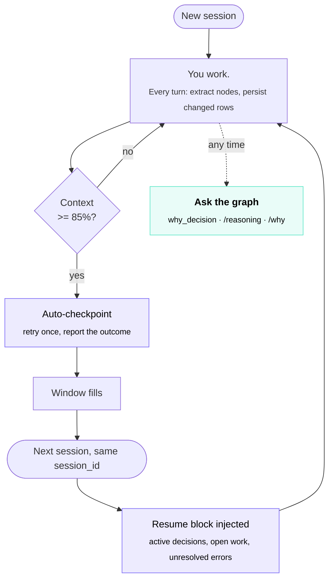

# Architecture

How a request moves through TokenMizer, what the graph stores, and how a decision's lifecycle is tracked. Start here if you want to know *why* the resume block contains what it contains.

---

## How TokenMizer Solves It

TokenMizer is a **local proxy** between your app and any LLM. Every
request passes through a pipeline that builds a live knowledge graph,
compresses inputs, caches responses, and auto-checkpoints before context
runs out.



> **On the layer numbering:** `savings.routing` appears in API responses
> and is always `0`. Complexity-based model routing is **not
> implemented** — see [What is not implemented](../README.md#what-is-not-implemented).

---

## Request pipeline and data model

<div align="center">
  
</div>

### What happens on one request



### Decision lifecycle

The graph tracks *why* the current answer is current. A new decision in
an occupied slot supersedes the old one and records the transition, so
`/api/graph/{id}/why` can replay the chain.



### What the graph actually stores

Nodes are typed, and so are the edges between them. Extraction produces
this shape; the resume block is a filtered projection of it.



Every node carries `importance` and `confidence`. Importance decays for
completed work and superseded choices, never for goals or active
decisions — so a long session prunes what stopped mattering and keeps
what still does.

### Decision Memory — 4-State Model

| Status | Meaning | In Resume |
|---|---|---|
| 🟢 `ACTIVE` | Current — in effect | ✅ Always |
| 🟡 `SUPERSEDED` | Replaced by newer decision | ⚠️ 7 days |
| 🔴 `INVALIDATED` | Explicitly wrong/cancelled | ⚠️ Always (warning) |
| ⬜ `ARCHIVED` | Superseded >7 days ago — aged out | ❌ Never |

History is **never deleted**. "Why did we switch from React to Next.js?" — always answerable:
ask `GET /api/graph/{session}/why?q=react` (or the `why_decision` MCP tool) and get the full
old → new trail with trigger, reason, and evidence per hop.

### From Storage to Reasoning

The graph doesn't just store facts — it answers questions over them:

| Capability | Endpoint / Tool | What it answers |
|---|---|---|
| **Ontology** | `GET /api/ontology` | The formal vocabulary: node/edge types with semantics, and the status state machine (which lifecycle transitions are legal) |
| **Causal chains** | `GET /api/graph/{id}/why?q=...` · MCP `why_decision` | "Why is X the current choice?" — walks the supersession chain with trigger/reason/evidence per hop |
| **Reasoning view** | `GET /api/graph/{id}/reasoning` | Active decisions per topic, recent changes, decision timeline, and a consistency audit |
| **Consistency audit** | (part of `/reasoning`) | Contradictions the tracker missed, superseded decisions with lost history, dangling references |

All reasoning is deterministic and local — no LLM calls, no extra cost.

---

## Session Resume

```bash
tokenmizer checkpoint my-project
tokenmizer resume my-project
```

```
Goal: Build FastAPI auth service with JWT + PostgreSQL
Done: Project setup | User model | Login endpoint | Fix 422 | 18 tests passing
In progress: Refresh token rotation
Decided: PostgreSQL (concurrent writes) | bcrypt | Redis for refresh tokens
Changed: ~~React~~ → Next.js (better SEO)
Files: api/auth.py, api/models.py, config.py
Continue: Implement token refresh endpoint
```

**247 tokens** replaces **25,000+ tokens** of conversation history.

### The loop, end to end

Nothing here needs a command in the common case: the checkpoint fires on
its own when the context window fills, and the resume block is injected
into the next session's first request. The CLI is for driving it by hand.



What is *not* carried forward is as deliberate as what is. Superseded
decisions are hidden from the resume but kept in history, so the model
does not re-propose a choice you already moved off — while
`why_decision` can still replay how you got here. Invalidated ones are
surfaced explicitly, as "do not revisit".

---

## File Intelligence

```python
from tokenmizer.filters.file_intelligence import FileIntelligence

fi = FileIntelligence()
result = fi.process(open("sales.csv","rb").read(), "sales.csv",
                    token_budget=500, query="which regions underperforming")
# 412,000 tokens → 447 tokens  (99.9% saved)
```

| File | Savings |
|---|---|
| CSV (50k rows) | 99.9% |
| PDF (200 pages) | 98.8% |
| Excel (10 sheets) | 99.7% |
| JSON (1k items) | 95% |


---

[← Back to the README](../README.md)
