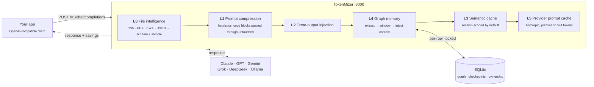
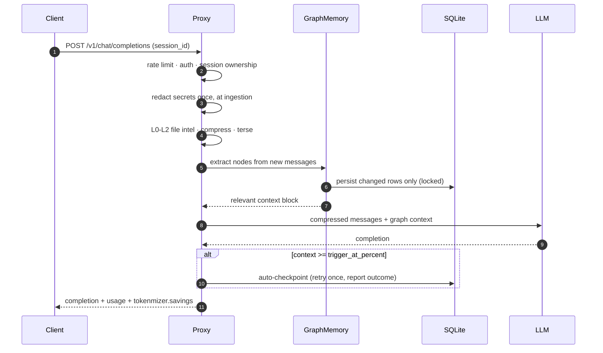
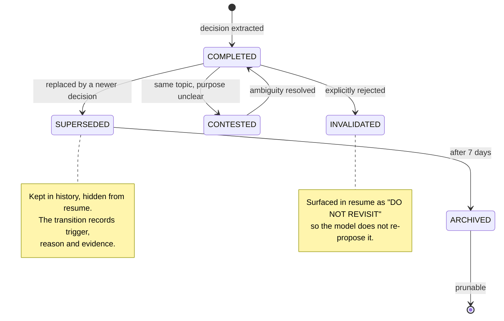
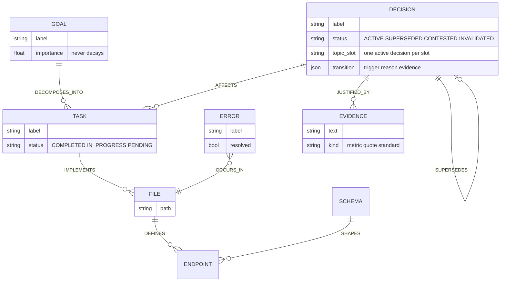
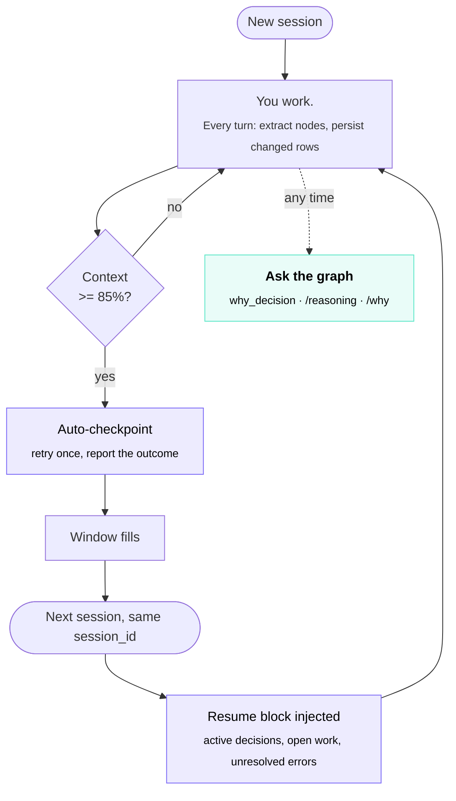

# Architecture

How a request moves through TokenMizer, what the graph stores, and how a decision's lifecycle is tracked. Start here if you want to know *why* the resume block contains what it contains.

---

## How TokenMizer Solves It

TokenMizer is a **local proxy** between your app and any LLM. Every
request passes through a pipeline that builds a live knowledge graph,
compresses inputs, caches responses, and auto-checkpoints before context
runs out.


```mermaid
flowchart LR
    App["Your app<br/><sub>OpenAI-compatible client</sub>"]
    subgraph TM["TokenMizer :8000"]
        direction TB
        L0["<b>L0</b> File intelligence<br/><sub>CSV · PDF · Excel · JSON → schema + sample</sub>"]
        L1["<b>L1</b> Prompt compression<br/><sub>heuristics; code blocks passed through untouched</sub>"]
        L2["<b>L2</b> Terse-output injection"]
        L4["<b>L4</b> Graph memory<br/><sub>extract → window → inject context</sub>"]
        L3["<b>L3</b> Semantic cache<br/><sub>session-scoped by default</sub>"]
        L5["<b>L5</b> Provider prompt cache<br/><sub>Anthropic, prefixes ≥1024 tokens</sub>"]
        L0 --> L1 --> L2 --> L4 --> L3 --> L5
    end
    LLM["Claude · GPT · Gemini<br/>Grok · DeepSeek · Ollama"]
    DB[("SQLite<br/><sub>graph · checkpoints · ownership</sub>")]

    App -->|"POST /v1/chat/completions"| TM
    TM --> LLM
    LLM -.->|response| TM
    TM -.->|"response + savings"| App
    L4 <-->|"per-row, locked"| DB
```

> **On the layer numbering:** there is no routing layer. `savings.routing`
> used to appear in every API response as a hardcoded `0`; it has been
> removed, along with the `routing:` config block it reported for.
> `model_map` replaces it — see [What is not implemented](../README.md#what-is-not-implemented).

---

## Request pipeline and data model

<div align="center">
  
</div>

### What happens on one request


```mermaid
sequenceDiagram
    autonumber
    participant C as Client
    participant P as Proxy
    participant G as GraphMemory
    participant S as SQLite
    participant L as LLM

    C->>P: POST /v1/chat/completions (session_id)
    P->>P: rate limit · auth · session ownership
    P->>P: redact secrets once, at ingestion
    P->>P: L0-L2 file intel · compress · terse
    P->>G: extract nodes from new messages
    G->>S: persist changed rows only (locked)
    G-->>P: relevant context block
    P->>L: compressed messages + graph context
    L-->>P: completion
    alt context >= trigger_at_percent
        P->>S: auto-checkpoint (retry once, report outcome)
    end
    P-->>C: completion + usage + tokenmizer.savings
```

### Decision lifecycle

The graph tracks *why* the current answer is current. A new decision in
an occupied slot supersedes the old one and records the transition, so
`/api/graph/{id}/why` can replay the chain.


```mermaid
stateDiagram-v2
    [*] --> COMPLETED: decision extracted
    COMPLETED --> SUPERSEDED: replaced by a newer decision
    COMPLETED --> CONTESTED: same topic, purpose unclear
    COMPLETED --> INVALIDATED: explicitly rejected
    CONTESTED --> COMPLETED: ambiguity resolved
    SUPERSEDED --> ARCHIVED: after 7 days
    ARCHIVED --> [*]: prunable

    note right of SUPERSEDED
        Kept in history, hidden from resume.
        The transition records trigger,
        reason and evidence.
    end note
    note right of INVALIDATED
        Surfaced in resume as "DO NOT REVISIT"
        so the model does not re-propose it.
    end note
```

### What the graph actually stores

Nodes are typed, and so are the edges between them. Extraction produces
this shape; the resume block is a filtered projection of it.


```mermaid
erDiagram
    GOAL ||--o{ TASK : "DECOMPOSES_INTO"
    DECISION ||--o{ TASK : "AFFECTS"
    TASK ||--o{ FILE : "IMPLEMENTS"
    ERROR }o--|| FILE : "OCCURS_IN"
    DECISION ||--o| DECISION : "SUPERSEDES"
    FILE ||--o{ ENDPOINT : "DEFINES"
    SCHEMA ||--o{ ENDPOINT : "SHAPES"
    DECISION ||--o{ EVIDENCE : "JUSTIFIED_BY"

    GOAL {
        string label
        float importance "never decays"
    }
    DECISION {
        string label
        string status "ACTIVE SUPERSEDED CONTESTED INVALIDATED"
        string topic_slot "one active decision per slot"
        json transition "trigger reason evidence"
    }
    TASK {
        string label
        string status "COMPLETED IN_PROGRESS PENDING"
    }
    ERROR {
        string label
        bool resolved
    }
    FILE {
        string path
    }
    EVIDENCE {
        string text
        string kind "metric quote standard"
    }
```

Every node carries `importance` and `confidence`. Importance decays for
completed work and superseded choices, never for goals or active
decisions — so a long session prunes what stopped mattering and keeps
what still does.

### Decision Memory — 4-State Model

| Status | Meaning | In Resume |
|---|---|---|
| `ACTIVE` | Current — in effect | Always |
| `SUPERSEDED` | Replaced by newer decision | 7 days |
| `INVALIDATED` | Explicitly wrong/cancelled | Always, flagged |
| `ARCHIVED` | Superseded >7 days ago — aged out | Never |

History is **never deleted**. "Why did we switch from React to Next.js?" — always answerable:
ask `GET /api/graph/{session}/why?q=react` (or the `why_decision` MCP tool) and get the full
old → new trail with trigger, reason, and evidence per hop.

### From Storage to Reasoning

The graph doesn't just store facts — it answers questions over them:

| Capability | Endpoint / Tool | What it answers |
|---|---|---|
| **Ontology** | `GET /api/ontology` | The formal vocabulary: node/edge types with semantics, and the status state machine (which lifecycle transitions are legal) |
| **Causal chains** | `GET /api/graph/{id}/why?q=...` · MCP `why_decision` | "Why is X the current choice?" — walks the supersession chain with trigger/reason/evidence per hop |
| **Reasoning view** | `GET /api/graph/{id}/reasoning` | Active decisions per topic, recent changes, decision timeline, and a consistency audit |
| **Consistency audit** | (part of `/reasoning`) | Contradictions the tracker missed, superseded decisions with lost history, dangling references |

All reasoning is deterministic and local — no LLM calls, no extra cost.

---

## Session Resume

```bash
tokenmizer checkpoint my-project
tokenmizer resume my-project
```

```
Goal: Build FastAPI auth service with JWT + PostgreSQL
Done: Project setup | User model | Login endpoint | Fix 422 | 18 tests passing
In progress: Refresh token rotation
Decided: PostgreSQL (concurrent writes) | bcrypt | Redis for refresh tokens
Changed: ~~React~~ → Next.js (better SEO)
Files: api/auth.py, api/models.py, config.py
Continue: Implement token refresh endpoint
```

A resume block like this — typically under 200 tokens, [measured](benchmarks.md#memory-quality--graph-vs-a-plain-summary)
at 178 on average — replaces tens of thousands of tokens of raw
conversation history.

### The loop, end to end

Nothing here needs a command in the common case: the checkpoint fires on
its own when the context window fills, and the resume block is injected
into the next session's first request. The CLI is for driving it by hand.


```mermaid
flowchart TD
    Start([New session]) --> Work["You work.<br/><sub>Every turn: extract nodes, persist changed rows</sub>"]
    Work --> Check{"Context<br/>>= 85%?"}
    Check -->|no| Work
    Check -->|yes| Ckpt["Auto-checkpoint<br/><sub>retry once, report the outcome</sub>"]
    Ckpt --> Full["Window fills"]
    Full --> New([Next session, same session_id])
    New --> Resume["Resume block injected<br/><sub>active decisions, open work, unresolved errors</sub>"]
    Resume --> Work

    Work -.->|"any time"| Ask["<b>Ask the graph</b><br/><sub>why_decision · /reasoning · /why</sub>"]

    classDef auto fill:#7c6af722,stroke:#7c6af7,color:inherit
    classDef ask  fill:#5ee7c822,stroke:#5ee7c8,color:inherit
    class Ckpt,Resume auto
    class Ask ask
```

What is *not* carried forward is as deliberate as what is. Superseded
decisions are hidden from the resume but kept in history, so the model
does not re-propose a choice you already moved off — while
`why_decision` can still replay how you got here. Invalidated ones are
surfaced explicitly, as "do not revisit".

### The turns windowing drops

Windowing replaces every turn older than the protected tail with the
block above. Anything the ontology captured survives that, because it is
a node — but a budget, a deadline, a licence restriction or a latency
target is none of the seven types, so all of them used to leave the
session at that moment, permanently.

A `SUMMARY` node holds them now, and they reach the next turn as a
`Noted:` line. The selector (`graph_memory/summary.py`) keeps a clause
only if it carries a quantity with a unit or a constraint verb, and only
if no node already covers it — restating a node spends resume budget on
nothing. One node per session, rewritten as the dropped span grows.

Measured in [benchmarks](benchmarks.md): out-of-ontology retention 0% to
100% on the fixtures in `benchmarks/resume_quality`, at +25 tokens of
resume block per session, with no section lost on the captured
transcripts in the eval corpus.

---

## File Intelligence

```python
from tokenmizer.filters.file_intelligence import FileIntelligence

fi = FileIntelligence()
result = fi.process(open("sales.csv","rb").read(), "sales.csv",
                    token_budget=500, query="which regions underperforming")
```

A file is replaced by a summary capped at `token_budget`, so the
percentage saved is set by the file's size and the budget, not by how good
the summary is — a 50,000-row CSV at a 500-token budget "saves" over 99%
whatever the summary says. What matters is whether the question can still
be answered from it.

For a table that means the schema, per-column statistics, and a
**per-group breakdown**: every text column with 2–12 distinct values
against the numeric columns, count, sum and mean per group, with the
columns the query names first so they survive the budget. Global
statistics alone could not answer the example above — a 50,000-row sales
file where one region's revenue averages 40% below the rest has an
ordinary-looking overall mean. With the breakdown the same file summarises
to about 240 tokens and the gap is on one line:

```
By region (rows · sum and mean per column, highest units mean first):
  east: n=10,002 · units sum=257,117 mean=25.71 · revenue sum=1,528,042.06 mean=152.77
  north: n=10,126 · units sum=259,431 mean=25.62 · revenue sum=2,581,759.28 mean=254.96
  ...
```

PDFs keep the pages that share the most words with the query; JSON keeps
its schema and array lengths; Excel runs the table strategy per sheet and
states the real row count when a sheet is larger than it summarises.


---

[← Back to the README](../README.md)
